---
## Front matter
title: "Лабораторная работа №3"
subtitle: "Дисциплина: Архитектура компьютера"
author: "Волгин Иван Алексеевич"

## Generic otions
lang: ru-RU
toc-title: "Содержание"

## Bibliography
bibliography: bib/cite.bib
csl: pandoc/csl/gost-r-7-0-5-2008-numeric.csl

## Pdf output format
toc: true # Table of contents
toc-depth: 2
lof: true # List of figures
lot: true # List of tables
fontsize: 12pt
linestretch: 1.5
papersize: a4
documentclass: scrreprt
## I18n polyglossia
polyglossia-lang:
  name: russian
  options:
	- spelling=modern
	- babelshorthands=true
polyglossia-otherlangs:
  name: english
## I18n babel
babel-lang: russian
babel-otherlangs: english
## Fonts
mainfont: PT Serif
romanfont: PT Serif
sansfont: PT Sans
monofont: PT Mono
mainfontoptions: Ligatures=TeX
romanfontoptions: Ligatures=TeX
sansfontoptions: Ligatures=TeX,Scale=MatchLowercase
monofontoptions: Scale=MatchLowercase,Scale=0.9
## Biblatex
biblatex: true
biblio-style: "gost-numeric"
biblatexoptions:
  - parentracker=true
  - backend=biber
  - hyperref=auto
  - language=auto
  - autolang=other*
  - citestyle=gost-numeric
## Pandoc-crossref LaTeX customization
figureTitle: "Рис."
tableTitle: "Таблица"
listingTitle: "Листинг"
lofTitle: "Список иллюстраций"
lotTitle: "Список таблиц"
lolTitle: "Листинги"
## Misc options
indent: true
header-includes:
  - \usepackage{indentfirst}
  - \usepackage{float} # keep figures where there are in the text
  - \floatplacement{figure}{H} # keep figures where there are in the text
---

# Цель работы

Целью данной лабораторной работы является выполнение настройки и работы с системой контроля версий
Git (https://git-scm.com/) на собственной технике.
Характеристики: Intel(R) Core(TM) i5-1135G7 @ 2.40GHz, 16Гб оперативной памяти, 400Гб свободного места на
жестком диске.

# Задание

1. Настроить GitHub

# Выполнение лабораторной работы

1. Первым шагом является создание учетной записи на git.hub и заполнение основных данных (рис. [-@fig:002]).

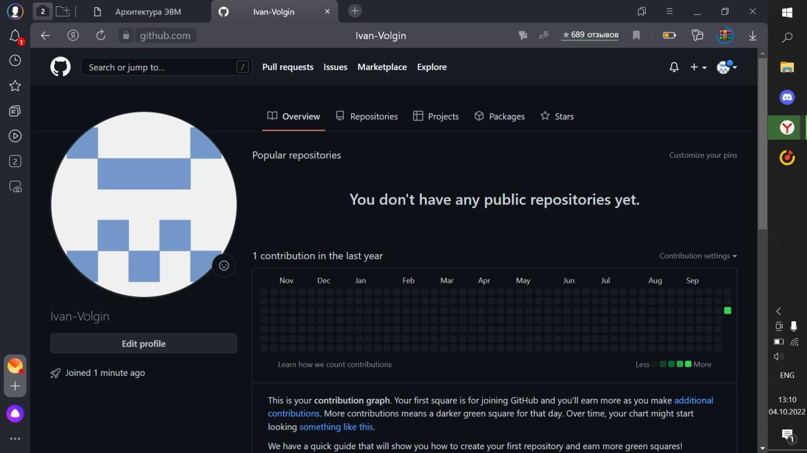{ #fig:001 width=70% }

2. Далее делаю предварительную конфигурацию git. Открываю терминал и ввожу следующие команды, указав
имя и email владельца репозитория (рис. [-@fig:003]).

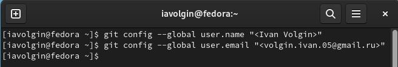{ #fig:002 width=70% }

3. Настраиваю utf-8 в выводе сообщений git (рис. [-@fig:002]).

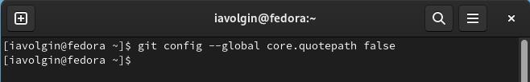{ #fig:003 width=70% }

4. адаю имя начальной ветки (master), а так же задаю параметры autocrlf и safecrlf (рис. [-@fig:004]).

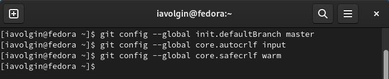{ #fig:004 width=70% }

5. Для последующей идентификации пользователя на сервере репозиториев необходимо сгенерировать пару
ключей (приватный и открытый). Генерирую открытый ключ (рис. [-@fig:005]).

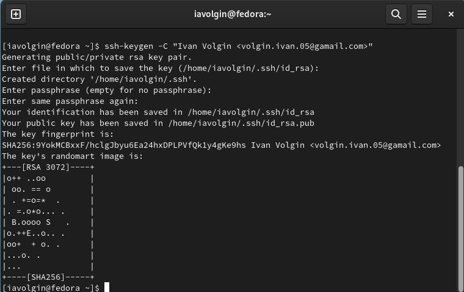{ #fig:005 width=70% }

6. Далее необходимо загрузить сгенерённый открытый ключ. Для захожу на сайт http://github.org/ под своей
учётной записью и перехожу в меню Setting . После этого выбираю в боковом меню SSH and GPG keys и
нажимаю кнопку New SSH key . Скопировав из локальной консоли ключ в буфер обмена с помощью команды
«cat ~/.ssh/id_rsa.pub | xclip -sel clip» вставляю ключ в появившееся на сайте поле и указываю для ключа имя
(рис [-@fig:006]).

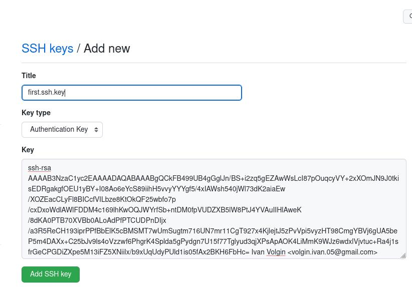{ #fig:006 width=70% }

7. Далее создаю рабочее пространство и репозиторий курса на основе шаблона. Для начала открываю терминал
и создаю каталог для предмета «Архитектура компьютера» с помощю команды «mkdir -p ~/work/study/2022-
2023/"Архитектура компьютера"» (рис. [-@fig:007).

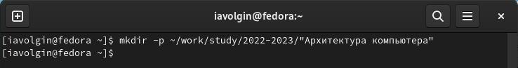{ #fig:007 width=70% }

8. Перехожу на станицу репозитория с шаблоном курса https://github.com/yam adharma/course-directory-student-
template. Далее выбераю «Use this template» (рис. [-@fig:008]).

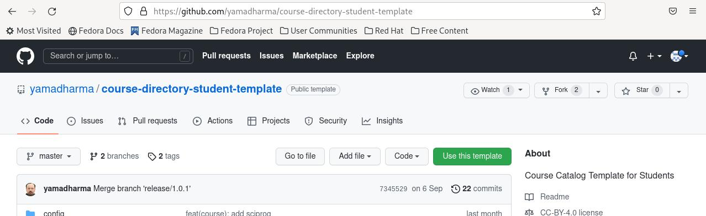{ #fig:008 width=70% }

9. В открывшемся окне задаю имя репозитория study_2022–2023_arh-pc и создаю репозиторий «Create
repository from template» (рис. [-@fig:009]).

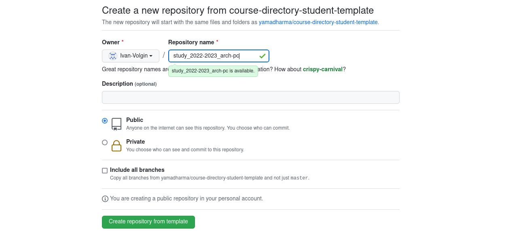{ #fig:009 width=70% }

10. Открываю терминал и перехожу в каталог курса с помощью команды «cd ~/work/study/2022-
2023/"Архитектура компьютера"». Ссылку для клонирования копирую на странице созданного репозитория
(рис. [-@fig:010]). Клонирую созданный репозиторий (рис. [-@fig:011]).

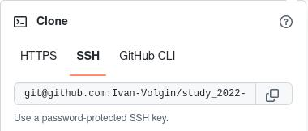{ #fig:010 width=70% }

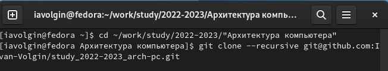{ #fig:011 width=70% }

11. Перехожу в каталог курса «arch-pc» и удаляю ненужные файлы с помощью команды «rm package.json»
(рис.[-@fig:12).

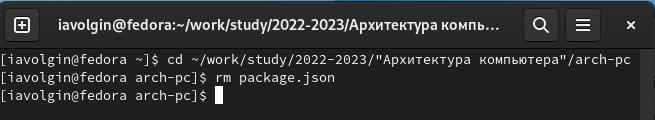{ #fig:012 width=70% }

12. Создаю необходимые каталоги командами «echo arch-pc > COURSE» и «make» (рис. [-@fig:13]).

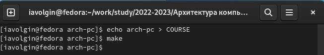{ #fig:013 width=70% }

13. Отправляю файлы на сервер с помощью команд «git add .», «git commit -am 'feat(main): make course
structure'», «git push» (рис. [-@fig:014]) и (рис. [-@fig:015]).

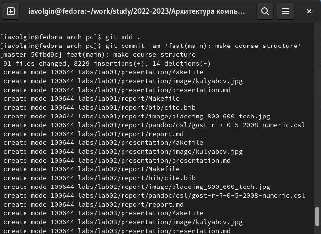{ #fig:014 width=70% }

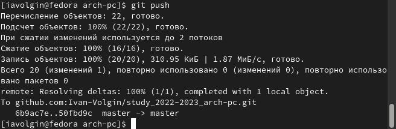{ #fig:015 width=70% }

14. Проверяю правильность создания иерархии рабочего пространства в локальном репозитории и на странице
github (рис. [-@fig:016]) и (рис. [-@fig:017]).

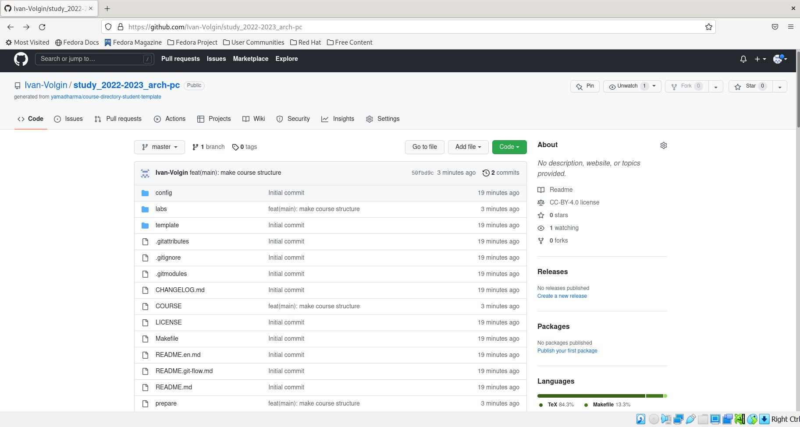{ #fig:016 width=70% }

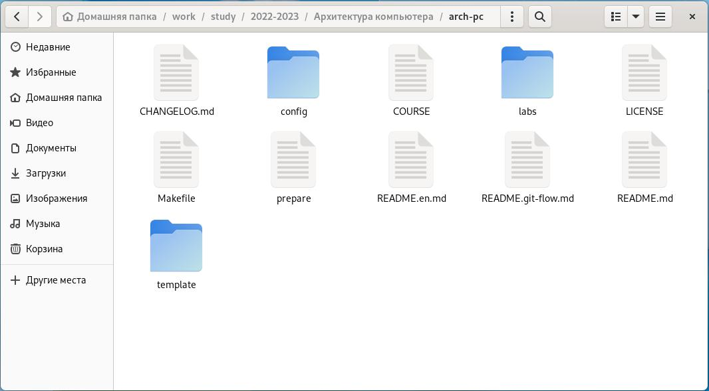{ #fig:017 width=70% }

# Выводы

В ходе данной лабораторной я выполнил настройку и работу с системой контроля версий Git (https://git-
scm.com/) на собственной технике.

# Задания для самостоятельной работы

Я скачал свои первую и вторую лабораторные работы в файлы lab1 и lab2 соответственно. Сохранил все
изменения и отправил их на git hub (рис. [-@fig:018]).

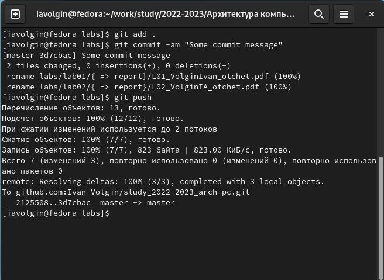{ #fig:018 width=70% }

Завершаю данную лабораторную работу и сохраняю ее на github в labs>lab03>report (без скриншота).

::: {#refs}
:::
