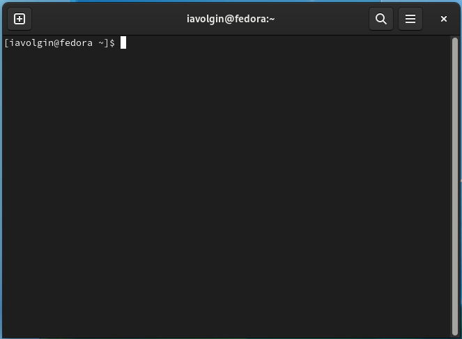
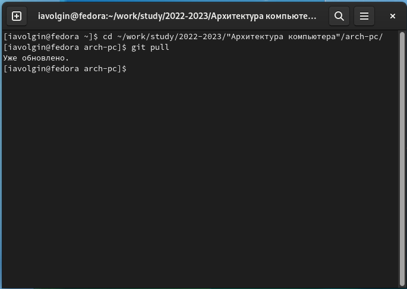
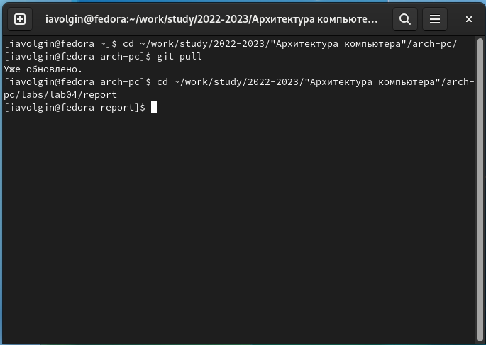
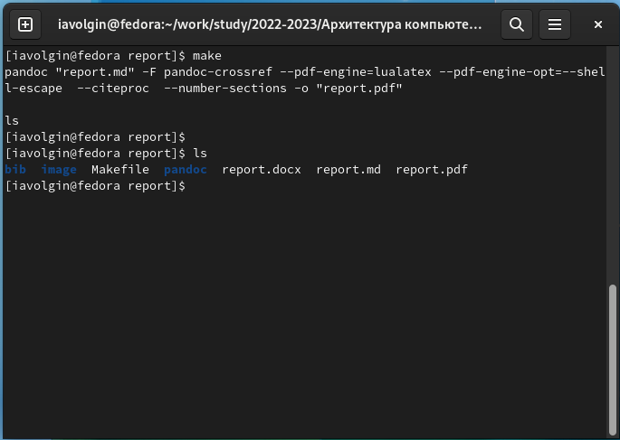
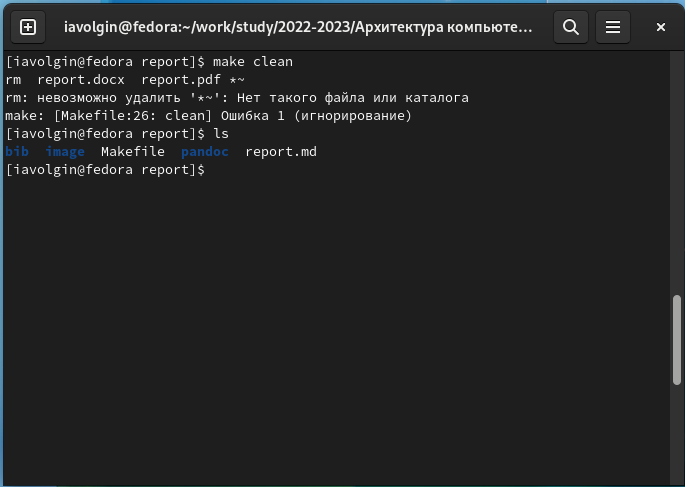
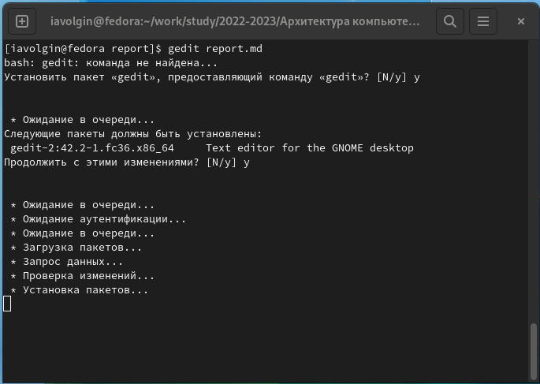
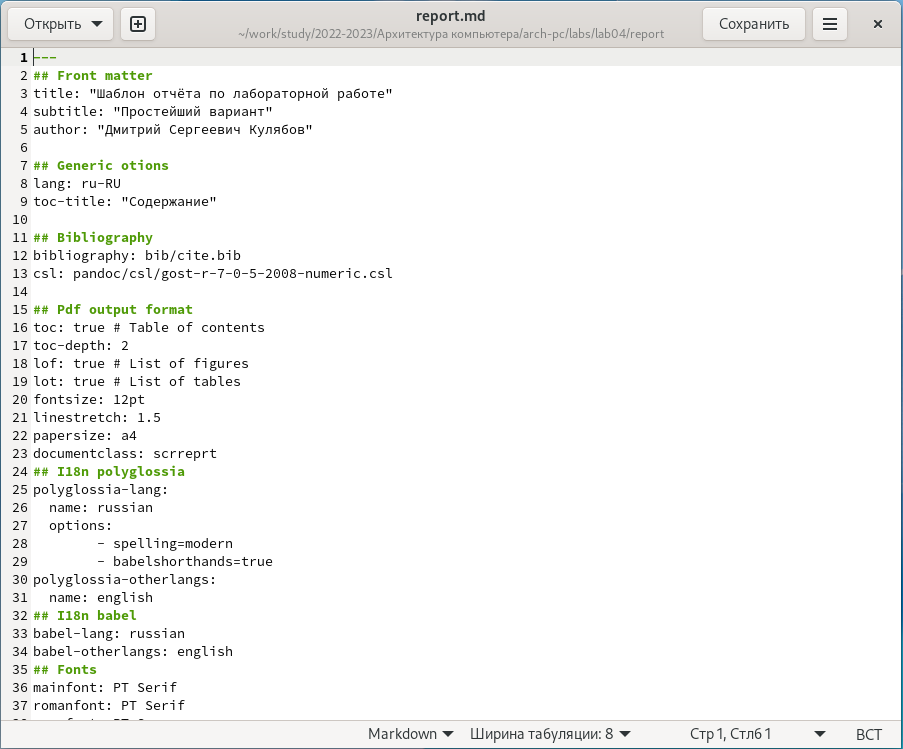

---
## Front matter
title: "Лабораторная работа №4"
subtitle: "дисциплина: Архитектура компьютера"
author: "Волгин Иван Алекссевич"

## Generic otions
lang: ru-RU
toc-title: "Содержание"
## Bibliography
bibliography: bib/cite.bib
csl: pandoc/csl/gost-r-7-0-5-2008-numeric.csl

## Pdf output format
toc: true # Table of contents
toc-depth: 2
lof: true # List of figures
lot: true # List of tables
fontsize: 12pt
linestretch: 1.5
papersize: a4
documentclass: scrreprt
## I18n polyglossia
polyglossia-lang:
  name: russian
  options:
	- spelling=modern
	- babelshorthands=true
polyglossia-otherlangs:
  name: english
## I18n babel
babel-lang: russian
babel-otherlangs: english
## Fonts
mainfont: PT Serif
romanfont: PT Serif
sansfont: PT Sans
monofont: PT Mono
mainfontoptions: Ligatures=TeX
romanfontoptions: Ligatures=TeX
sansfontoptions: Ligatures=TeX,Scale=MatchLowercase
monofontoptions: Scale=MatchLowercase,Scale=0.9
## Biblatex
biblatex: true
biblio-style: "gost-numeric"
biblatexoptions:
  - parentracker=true
  - backend=biber
  - hyperref=auto
  - language=auto
  - autolang=other*
  - citestyle=gost-numeric
## Pandoc-crossref LaTeX customization
figureTitle: "Рис."
tableTitle: "Таблица"
listingTitle: "Листинг"
lofTitle: "Список иллюстраций"
lotTitle: "Список таблиц"
lolTitle: "Листинги"
## Misc options
indent: true
header-includes:
  - \usepackage{indentfirst}
  - \usepackage{float} # keep figures where there are in the text
  - \floatplacement{figure}{H} # keep figures where there are in the text
---

# Цель работы

Цель работы - освоить основы легковесного языка разметки Markdown и сделать с помощью него отчет

# Задание

1. Освоение основ языка разметки Markdown во время создания отчета по лабораторной работе №4
2. На сонове полученных знаний сделать отчет по лабораторной работе №3.

# Выполнение лабораторной работы

1. Первым шагом нужно откыть терминал, потому что вся дальнейшая работа будет происходить в нем (рис. [-@fig:001]).

{ #fig:001 width=70% }

2. Далее я перешел в каталог курса, сформированный при выполнении лабораторной работы №3 и обновил локальный репозиторий (рис. [-@fig:002]).

{ #fig:002 width=70% }

3. После этого перешел в каталог с шаблоном отчета по лабораторной работе №4 (рис. [-@fig:003]).

{ #fig:003 width=70% }

4. Далее я провел компиляцию шаблона с использованием Makefile с помощью команды make. После успешной компиляции сгенерировались файлы report.pdf и report.docx(рис. [-@fig:004]).

{ #fig:004 width=70% }

5. Следующим шагом я удалил полученные файлы, так же с помощью Makefile, использовав команду make clean (рис. [-@fig:005]).

{ #fig:005 width=70% }

6. После этого я открыл файл report.md с помощью текстового редактора gedit (команда gedit report.md) (рис. [-@fig:006]).

{ #fig:006 width=70% }

7. Внимательно изучаю файл и приступаю к заполнению отчета (рис. [-@fig:007]).

{ #fig:007 width=70% }

8. Когда все было готово, я сохранил изменения и провел компиляцию файла с использованием makefile.

9. Далее загрузил все на github. (последние два шага без скриншотов, потому что они выполняются после заполнения отчета).

# Выводы

В итоге, после выполнения лабораторной работы, я освоил основы языка разметки Markdown и научился делать с помощью него отчеты

# Задания для самостоятельнойй работы

В соответствующем каталоге я сделал отчет по лабораторной работе №3 в формате Markdow и загрузил файлы на github.

::: {#refs}
:::
