---
## Front matter
title: "Лабораторная работа №5"
subtitle: "Дисциплина: Архитектура компьютера"
author: "Волгин Иван Алексеевич"

## Generic otions
lang: ru-RU
toc-title: "Содержание"

## Bibliography
bibliography: bib/cite.bib
csl: pandoc/csl/gost-r-7-0-5-2008-numeric.csl

## Pdf output format
toc: true # Table of contents
toc-depth: 2
lof: true # List of figures
lot: true # List of tables
fontsize: 12pt
linestretch: 1.5
papersize: a4
documentclass: scrreprt
## I18n polyglossia
polyglossia-lang:
  name: russian
  options:
	- spelling=modern
	- babelshorthands=true
polyglossia-otherlangs:
  name: english
## I18n babel
babel-lang: russian
babel-otherlangs: english
## Fonts
mainfont: PT Serif
romanfont: PT Serif
sansfont: PT Sans
monofont: PT Mono
mainfontoptions: Ligatures=TeX
romanfontoptions: Ligatures=TeX
sansfontoptions: Ligatures=TeX,Scale=MatchLowercase
monofontoptions: Scale=MatchLowercase,Scale=0.9
## Biblatex
biblatex: true
biblio-style: "gost-numeric"
biblatexoptions:
  - parentracker=true
  - backend=biber
  - hyperref=auto
  - language=auto
  - autolang=other*
  - citestyle=gost-numeric
## Pandoc-crossref LaTeX customization
figureTitle: "Рис."
tableTitle: "Таблица"
listingTitle: "Листинг"
lofTitle: "Список иллюстраций"
lotTitle: "Список таблиц"
lolTitle: "Листинги"
## Misc options
indent: true
header-includes:
  - \usepackage{indentfirst}
  - \usepackage{float} # keep figures where there are in the text
  - \floatplacement{figure}{H} # keep figures where there are in the text
---

# Цель работы

Освоение процедуры компляции и сборки программ, написанных на ассемблере NASM

# Задание

1. Создать программу на языке ассемблера NASM, которая выводит фразу "Hello world", пользуясь руководством.
2. Самостоятельно создать программу на языке ассемблера NASM, которая выводит фразу с именем и фамилией.

# Выполнение лабораторной работы

1. Первым шагом является создание каталога для работы с программами на языке ассемблера NASM и создание в этом каталоге файла "hello.asm" (рис. [-@fig:001]).

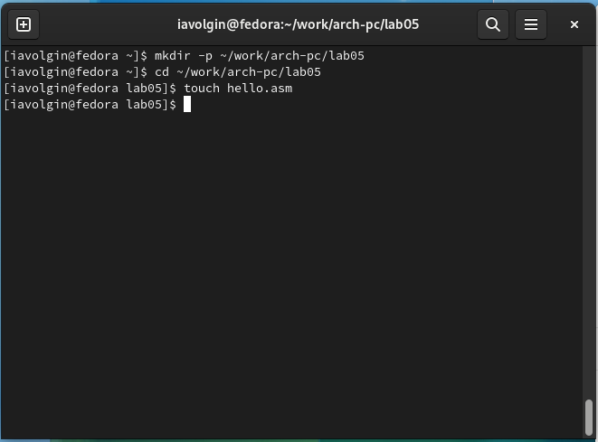{ #fig:001 width=70% }

2. Затем я открыл файл, который только что создал, и ввел текст, который можно увидеть раисунке (рис. [-@fig:002]).

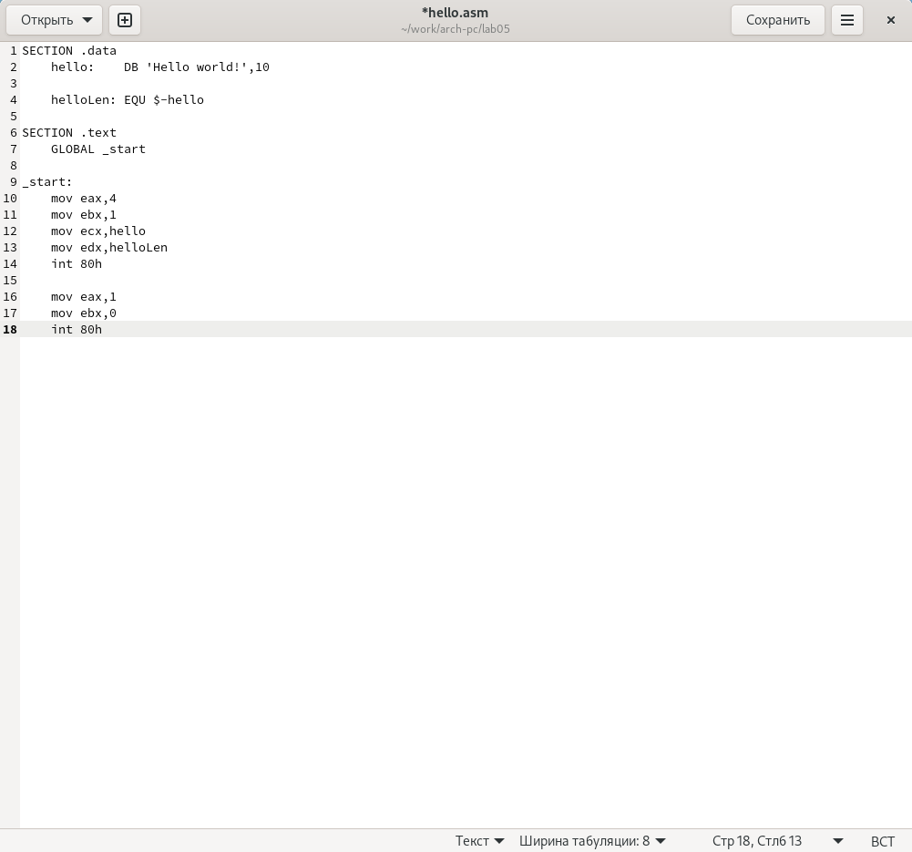{ #fig:002 width=70% }

3. Далее с помощью NASM превращаю текст программы в объектный код. Так как текст программы был набран без ошибок, транслятор преобразовал его в объектный код, который записался в файл с именем "hello.o". (рис. [-@fig:003]).

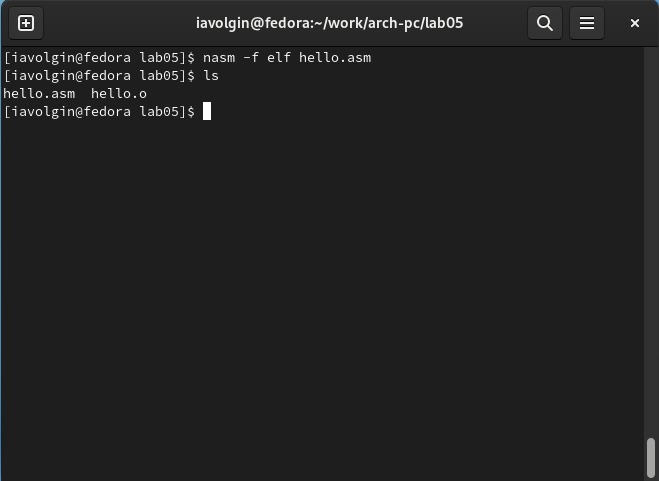{ #fig:003 width=70% }

4. Чтобы воспользоваться полным вариантом строки nasm, я ввел следующую команду, которая скомпилировала файл "hello.asm" в "obj.o", при этом формат выходного файла стал elf, в него включены символы для отладки, так же создан файл листинга "list.lst" (рис. [-@fig:004])

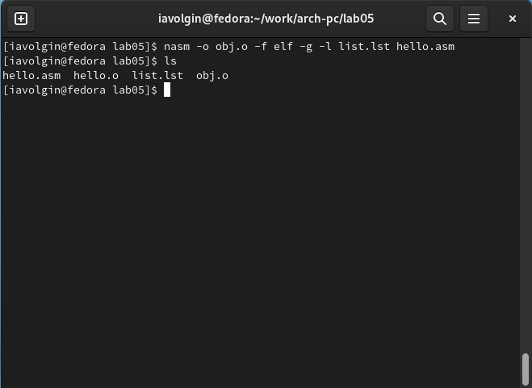{ #fig:004 width=70% }

5. Затем я получил исполняемую программу, передав объектный файл компановщику, и проверил что исполняемый файл был создан (рис. [-@fig:005]).

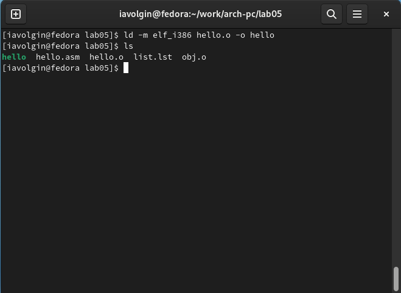{ #fig:005 width=70% }

6. Так же скомпоновал файл "obj.o" в "main". "main" - исполняемый файл, "obj.o"  - объектный файл (рис. [-@fig:006]).

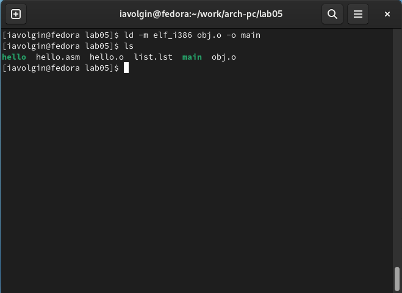{ #fig:006 width=70% }

7. Чтобы проверить, что все сделанно правильно запускаю исполняемый файл "hello". В терминал выводится фраза "Hello world!" (рис. [-@fig:007]).

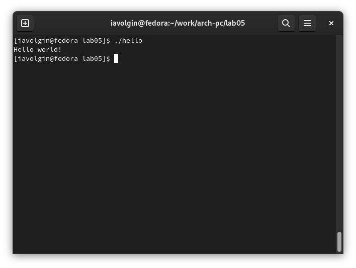{ #fig:007 width=70% }

# Задания для самостоятельной работы

1. В каталоге ~/workarch-pc/lab05 создаю копию файла "hello.asm" с именем "lab5.asm" (рис. [-@fig:008]).

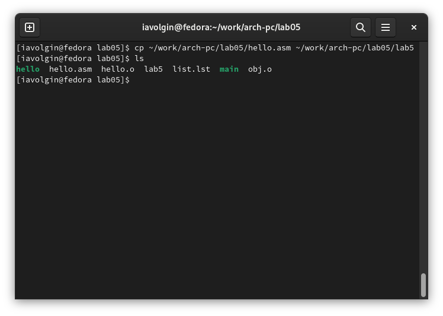{ #fig:008 width=70% }

2. Далее с помощью текстового редактора gedit вношу изменения в текст программы так, чтобы вместо фразы "Hello world!", она выводила мое имя и фамилию (рис. [-@fig:009]).

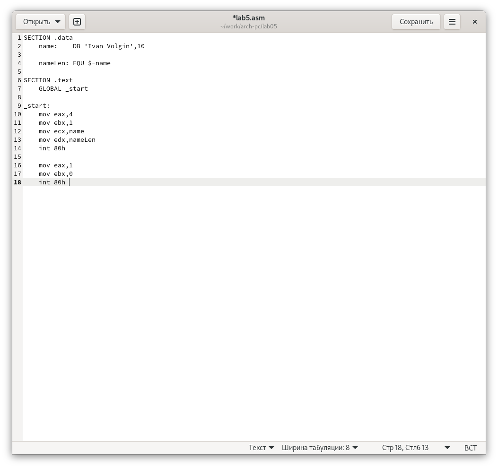{ #fig:009 width=70% }

3. Затем я получаю из текстового файла объектный код (рис. [-@fig:010]).

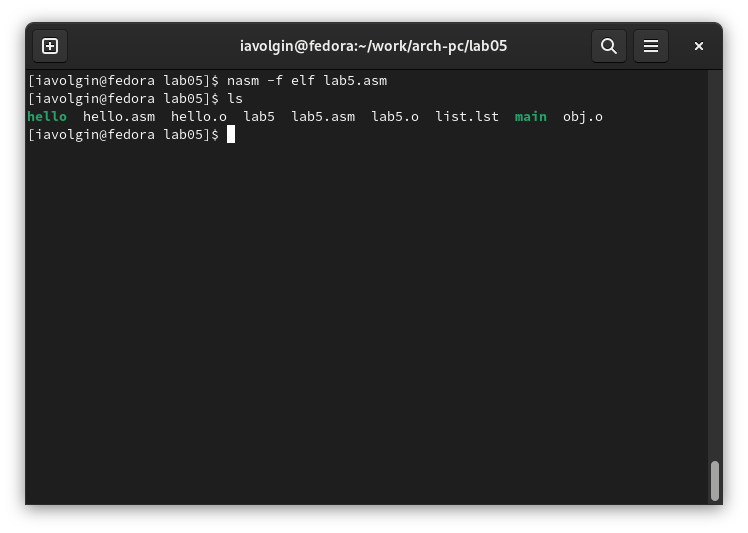{ #fig:010 width=70% }

4. Следующим шагом компаную объектный файл в исполняемый файл (рис. [-@fig:011]).

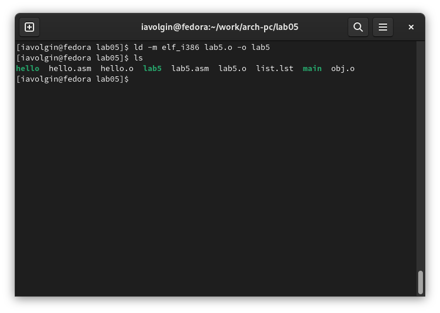{ #fig:011 width=70% }

5. Далее проверяю работу программы (рис. [-@fig:012]).

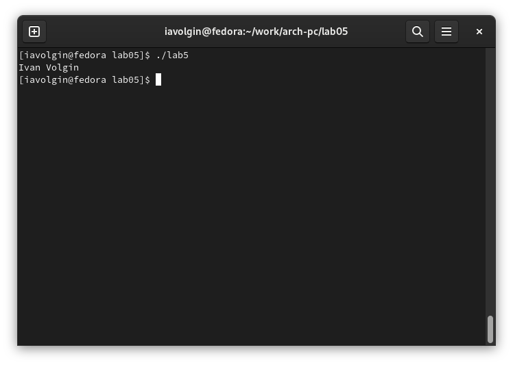{ #fig:012 width=70% }

6. Затем копирую файлы "hello.asm" и "lab5.asm" в мой локальный репозиторий в каталог, который можно уидеть в первой и второй команде (рис. [-@fig:013]).

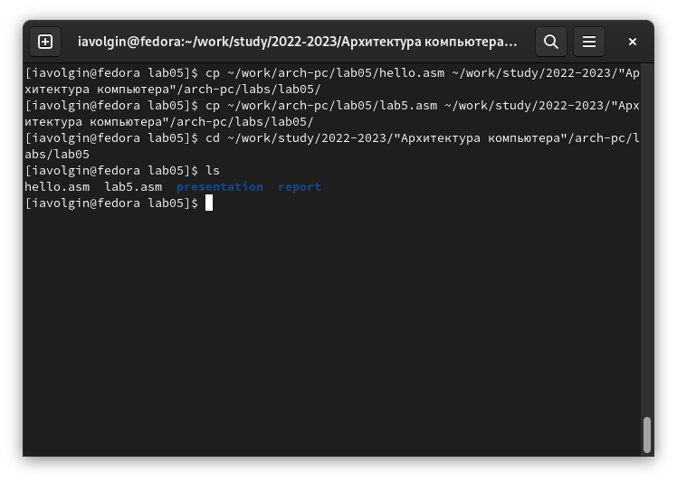{ #fig:013 width=70% }

7. Загружаю все новые файлы на github (рис. [-@fig:014]).

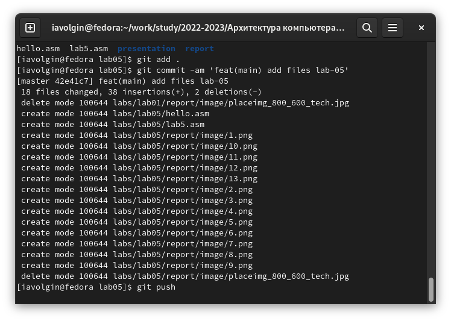{ #fig:014 width=70% }

# Выводы

После выполнения лабораторной работы №5, я освоил процедуры компляции и сборки программ, написанных на ассемблере NASM, а так же собственноручно создал две такие программы.

